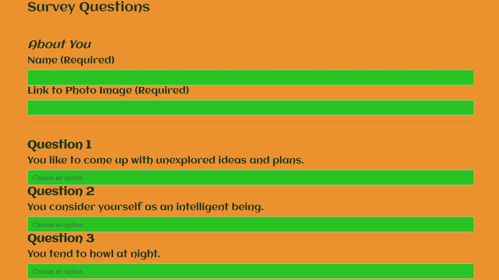
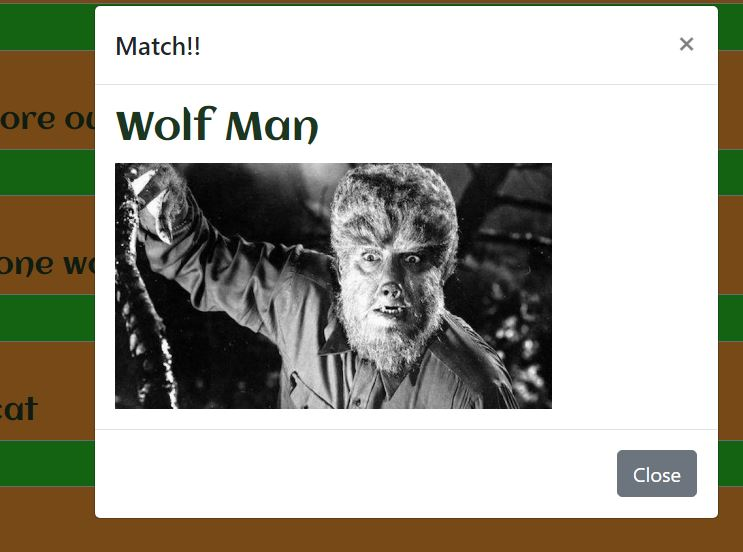
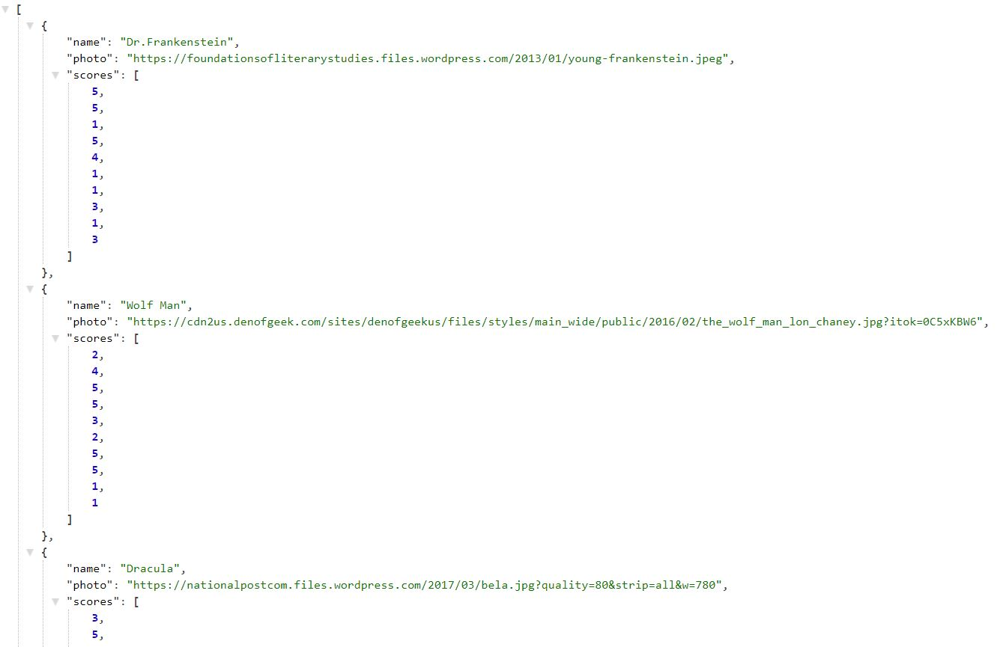

# Friend-Finder
a compatibility-based "FriendFinder" application -- basically a dating app. This full-stack site will take in results from your users' surveys, then compare their answers with those from other users. The app will then display the name and picture of the user with the best overall match.

## Technologies Used:

* Javascript
* jQuery
* Node.js
* Express.js
* Bootstrap
* Font Awesome
* Google Fonts

## npm packages:

* path
* express

## How to run Friend Finder:

* With the deployed link, the user is brought to the home page that contains a simple message and a start button to begin the survey.

* Once the user is at the survey page, they will input a name, and a link to a photo image of their choosing. The user must also answer 10 questions rating each question from 1 to 5

* After completing the last question of the survey, the user must click submit to get a match

* If the user clicks the api list before clicking submit, the json for all the characters can be seen

# Deployed Link
https://evening-fortress-10252.herokuapp.com/

##Developer

*William Gonzales*